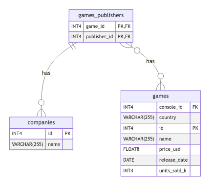

# UML Creator
Create UML diagrams for your database.

## How to:
1.  Download and unpack the zip file: [uml-creator-main,zip](https://github.com/TheVeteranDev/uml-creator/archive/refs/heads/main.zip)

2.  Open the src/main.js file and change the "event" object to the information for your database.
```
const event = {
    username: "YOUR_DB_USERNAME", 
    password: "YOUR_DB_PASSWORD", 
    host: "localhost", 
    port: "5432", 
    database: "postgres", 
    schemas: ["public"]
}
```

3.  Install node modules and run "npm start" in the root directory
```
npm i && npm start
```

4.  Winner, winner, chicken dinner!  All your diagrams are in the diagrams directory.

## Example Diagram

